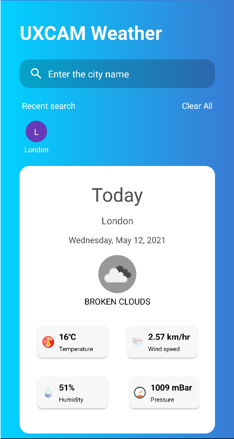
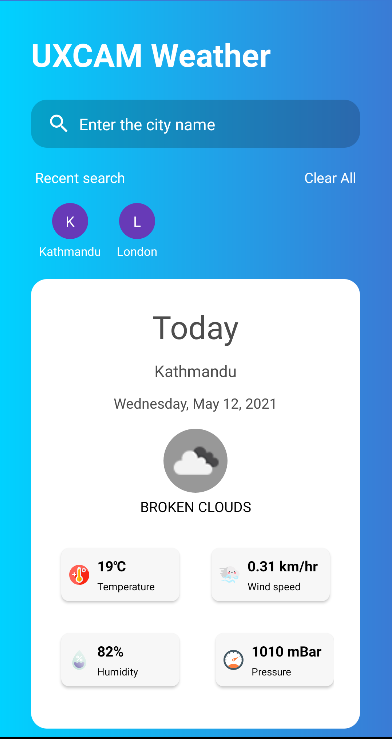

# UXCAM Application

This is application which shows current weather of entered city. This application is built for programming test for UXCAM Pvt. Ltd.

## Installation
1. Extract ***UXCAM*** folder to desired path
2. Open ***UXCAM*** folder using Android Studio.
3. Run application via Android Studio.

## Generating signed APK
From Android Studio:
1. ***Build*** menu
2. ***Generate Signed APK...*** 
3. Fill in the keystore information *(you only need to do this once manually and then let Android Studio remember it)*

## Architecture
1. Dependency Injection using Dagger Hilt
2. Database using SharedPreference for recent search
3. Network call using retrofit
4. Async call using RxJava
5. MVVM pattern
6. Data binding

## Screenshots

